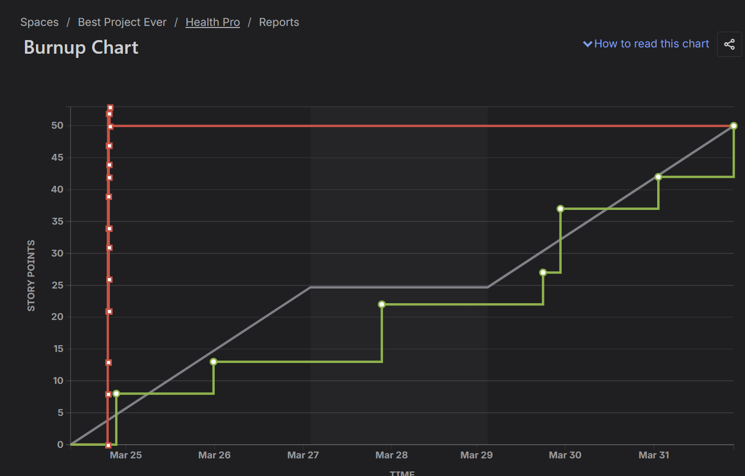

# Health Pro - Hospital Management System


**Web-based Hospital Management System** is designed to digitize hospital operations.

<br>

## 📋 Table of Contents
- [About the Project](#about-the-project)
- [Key Features](#key-features)
- [Benefits](#benefits)
- [Technologies Used](#technologies-used)
- [Sprints & Agile Development](#sprints--agile-development)
- [Screenshots](#screenshots)

## About the Project

**Health Pro** is a comprehensive web application for managing a mid-sized hospital. It aims to reduce paperwork, minimize medical errors, and improve coordination between medical staff.

**Developed by:**
- Sofia Ivanova
- Emine Yumer

## Key Features

- Patient registration & search by EGN
- Electronic Patient Records (EPR)
- Vital signs tracking
- Appointment scheduling system
- Doctor examinations with ICD-10 diagnosis support
- PDF report generation (Ambulatory sheets)
- Role-based access control (Doctor, Nurse, Admin, Patient)

## Benefits

- Reduction of paper documentation by **over 60%**
- Faster access to patient information
- Significant decrease in medical errors
- Better team coordination
- Intuitive interface for all user roles

## Technologies Used

- **Backend**: Django / Python
- **Frontend**: HTML, CSS, Bootstrap, JavaScript
- **Database**: PostgreSQL / SQLite
- **Other**: PDF generation, Role-based authentication

## Sprints & Agile Development

- **Methodology**: Scrum
- **Total Stories**: 14
- **Sprint 1**: Completed (52 Story Points)
- **Sprint 2**: In progress
- Used Burnup Chart for progress tracking

## Screenshots

<div align="center">
  
  
</div>


## How to Run

```bash
git clone https://github.com/yourusername/health-pro.git
cd health-pro
pip install -r requirements.txt
python manage.py migrate
python manage.py runserver
